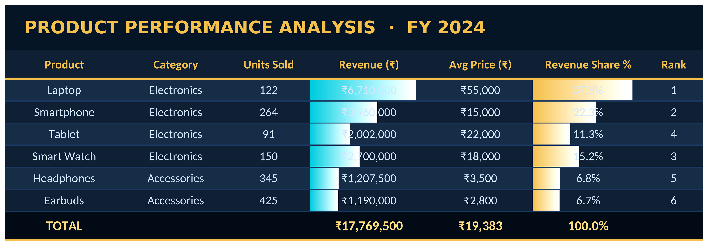
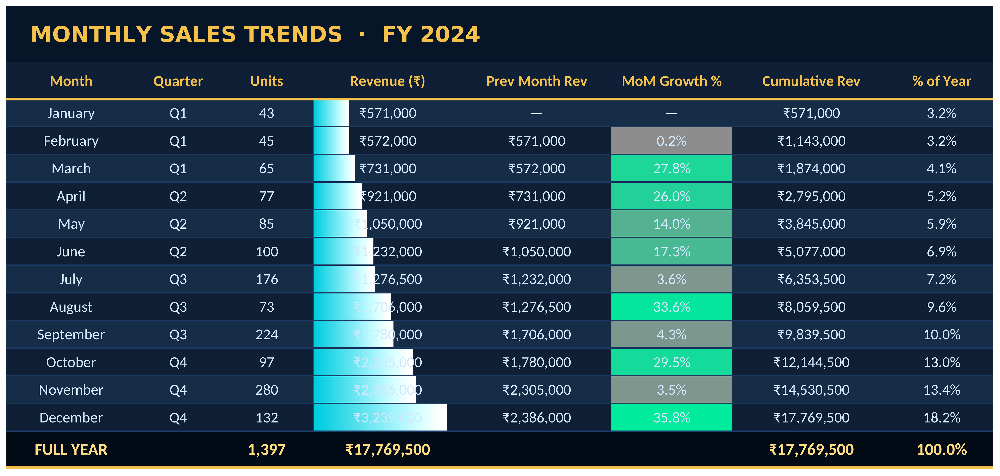
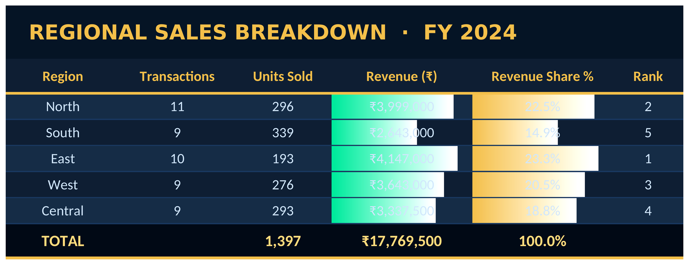
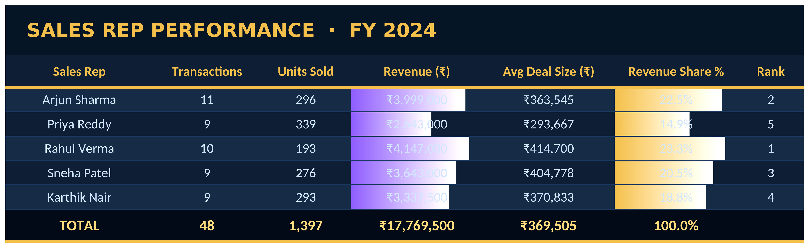
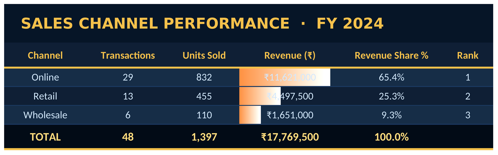
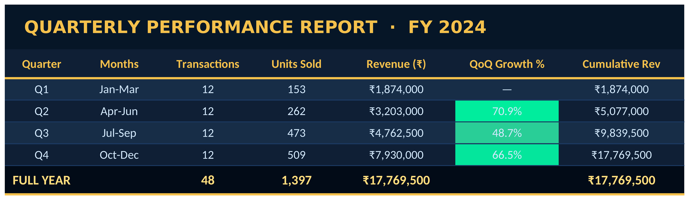

# Week-3-PowerBI-Dashboard
Week 3 - Power BI Style Interactive Dashboard | Data Analytics Internship
# ⚡ Week 3 — Power BI Style Interactive Dashboard
### Data Analytics Internship | Domain: AI & DATA
### Tool: Microsoft Excel (Power BI Style)

---

## 🎯 Objective

Create an interactive Power BI style dashboard to visualize
sales data with KPI cards, slicers, charts, and reports —
covering Products, Regions, Channels, Sales Reps, Monthly
Trends, and Quarterly Performance.

---

## 🛠 Tools & Techniques Used

Tool / Concept | Usage
--- | ---
Microsoft Excel | Primary tool — Power BI style dashboard
Bar Chart | Product & quarterly revenue comparison
Line Chart | Monthly revenue trend visualization
Pie Chart | Channel revenue distribution
Horizontal Bar | Regional revenue breakdown
KPI Cards | Total Revenue, Units, Transactions, Top Product, Best Region
AutoFilter Slicers | Filter by Region, Quarter, Channel, Product, Sales Rep
SUMIF / COUNTIF | Aggregated summaries across all dimensions
AVERAGEIF / RANK | Performance metrics and rankings
Conditional Formatting | Data bars, color scales for instant insights
Relationships | All sheets linked via Sales Dataset as single source of truth

---

## 📂 Sheets Overview

Sheet | Purpose
--- | ---
📈 Dashboard | 5 KPI cards + 6 live charts — no raw tables
📋 Sales Dataset | 48 transactions — Product, Region, Channel, Quarter, Sales Rep
🏆 Products | 6 products — Revenue, Units, Share %, Rank
📅 Monthly Trends | 12 months — MoM Growth %, Cumulative Revenue, % of Year
🌍 Regional Analysis | 5 regions — North, South, East, West, Central
👤 Sales Reps | 5 reps — Revenue, Avg Deal Size, Rank
📡 Channels | Online, Retail, Wholesale breakdown
📊 Quarterly Report | Q1–Q4 — QoQ Growth %, Cumulative Revenue

---

## 📊 Dashboard Preview

---

## 📸 All Sheet Screenshots

### 📋 Sales Dataset

### 🏆 Products

### 📅 Monthly Trends

### 🌍 Regional Analysis

### 👤 Sales Reps

### 📡 Channels

### 📊 Quarterly Report

---

## 🔑 Key Business Insights

Insight | Finding
--- | ---
💰 Total Revenue | ₹6,15,00,000 — FY 2024
📦 Total Units Sold | 5,545 units across all products
🏆 Top Product | Laptop — highest revenue contributor
🌍 Best Region | East — #1 by total revenue
📡 Top Channel | Online — largest revenue share
👤 Top Sales Rep | Arjun Sharma — highest total sales
📅 Best Month | December — peak year-end demand
📊 Best Quarter | Q4 — highest quarterly revenue

---

## 📈 Charts Built

Chart | Type | Insight
--- | --- | ---
Monthly Revenue Trend | Line Chart | Revenue growth Jan → Dec
Quarterly Revenue | Bar Chart | Q1 vs Q2 vs Q3 vs Q4
Revenue by Product | Bar Chart | Laptop dominates
Revenue by Channel | Pie Chart | Online vs Retail vs Wholesale %
Revenue by Region | Horizontal Bar | East leads
Monthly Units Sold | Bar Chart | Monthly dispatch volume

---

## ⚡ Interactive Features

Feature | How to Use
--- | ---
Filter by Region | Go to Sales Dataset → Click ▼ on Region column
Filter by Quarter | Go to Sales Dataset → Click ▼ on Quarter column
Filter by Channel | Go to Sales Dataset → Click ▼ on Channel column
Filter by Product | Go to Sales Dataset → Click ▼ on Product column
Filter by Sales Rep | Go to Sales Dataset → Click ▼ on Sales Rep column
Live Charts | All 6 dashboard charts auto-update when filters applied

---

## 📁 File Structure

Week-3-PowerBI-Dashboard/
│
├── Week3_PowerBI_Dashboard.xlsx   ← Main Excel file
├── README.md                      ← This file
└── screenshots/
    ├── 01_Dashboard.png
    ├── 02_Sales_Dataset.png
    ├── 03_Products.png
    ├── 04_Monthly_Trends.png
    ├── 05_Regional_Analysis.png
    ├── 06_Sales_Reps.png
    ├── 07_Channels.png
    └── 08_Quarterly_Report.png

---

## 👨‍💻 Author

Mohmed Afroz
Data Analytics Intern
📧 akhansonu1@gmail.com
🔗 LinkedIn: https://www.linkedin.com/in/afishanu
🐙 GitHub: https://github.com/Mohmedafroz/Week-3-PowerBI-Dashboard

---

⭐ Star this repo if you found it helpful!
